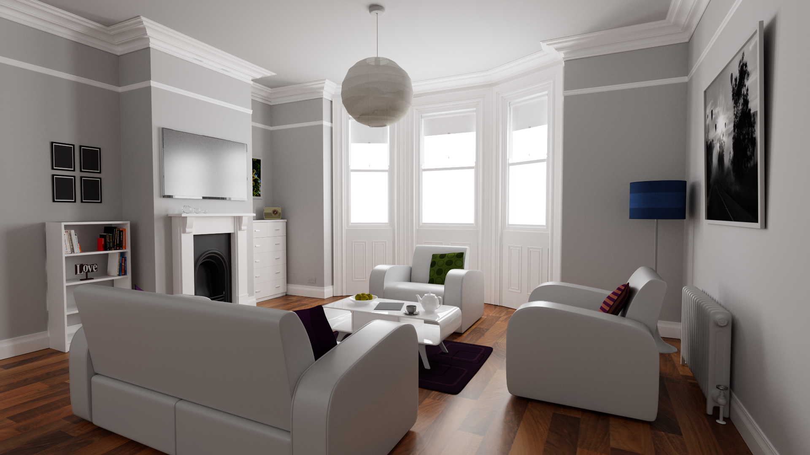
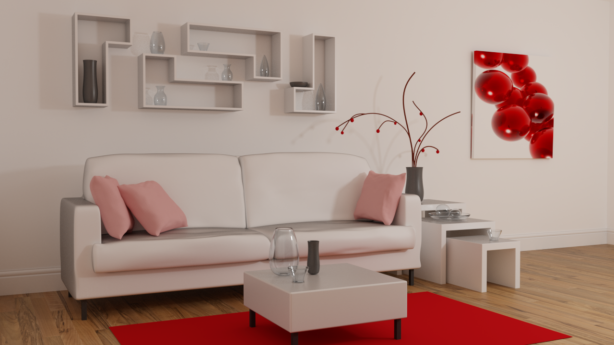

# LuisaRenderScenes

Scenes for [LuisaRender](https://github.com/LuisaGroup/LuisaRender).

## Contemporary Bathroom

Download: [LuisaRender](https://github.com/LuisaGroup/LuisaRenderScenes/releases/download/scenes/bathroom.zip)

- Author: [Mareck](http://www.blendswap.com/users/view/Mareck) (CC0)
- Converted from Tungsten version from [Rendering Resources](https://benedikt-bitterli.me/resources)
- Resolution: 1024x1024
- Samples: 65536
- Tonemapping: ACES (exposure = -0.5)

## Bedroom

Download: [LuisaRender](https://github.com/LuisaGroup/LuisaRenderScenes/releases/download/scenes/bedroom.zip)

- Author: [SlykDrako](http://www.blendswap.com/user/SlykDrako) (CC0)
- Converted from Tungsten version from [Rendering Resources](https://benedikt-bitterli.me/resources)
- Resolution: 1280x720
- Samples: 65536
- Tonemapping: ACES (exposure = -0.5)

## Camera

Download: [LuisaRender](https://github.com/LuisaGroup/LuisaRenderScenes/releases/download/scenes/camera.zip)

- Resources from [Poly Heaven](https://polyhaven.com) (CC0, see the contained `README.txt` for details)
- Resolution: 3840x2160
- Samples: 65536
- Tonemapping: Uncharted2

## Kitchen

Download: [LuisaRender](https://github.com/LuisaGroup/LuisaRenderScenes/releases/download/scenes/kitchen.zip)

- Author: [Jay-Artist](http://www.blendswap.com/user/Jay-Artist) ([CC BY 3.0](https://creativecommons.org/licenses/by/3.0))
- Converted from Tungsten version from [Rendering Resources](https://benedikt-bitterli.me/resources)
- Resolution: 1280x720
- Samples: 65536
- Tonemapping: ACES (exposure = -0.5)

## Spaceship

Download: [LuisaRender](https://github.com/LuisaGroup/LuisaRenderScenes/releases/download/scenes/spaceship.zip)

- Author: [thecali](http://www.blendswap.com/user/thecali) (CC0)
- Converted from Tungsten version from [Rendering Resources](https://benedikt-bitterli.me/resources)
- Resolution: 1920x1080
- Samples: 16384
- Tonemapping: Uncharted2

## Modern Hall

Download: [LuisaRender](https://github.com/LuisaGroup/LuisaRenderScenes/releases/download/scenes/staircase2.zip)

- Author: [NewSee2l035](http://www.blendswap.com/user/NewSee2l035) ([CC BY 3.0](https://creativecommons.org/licenses/by/3.0/))
- Converted from Tungsten version from [Rendering Resources](https://benedikt-bitterli.me/resources)
- Resolution: 1024x1024
- Samples: 65536
- Tonemapping: ACES (exposure = -0.5)

## The Wooden Staircase

Download: [LuisaRender](https://github.com/LuisaGroup/LuisaRenderScenes/releases/download/scenes/staircase.zip)

- Author: [Wig42](http://www.blendswap.com/users/view/Wig42) ([CC BY 3.0](https://creativecommons.org/licenses/by/3.0/))
- Converted from Tungsten version from [Rendering Resources](https://benedikt-bitterli.me/resources)
- Resolution: 1080x1920
- Samples: 16384
- Tonemapping: Uncharted2 (exposure = 0.5)

## Coffee Maker

Download: [LuisaRender](https://github.com/LuisaGroup/LuisaRenderScenes/releases/download/scenes/coffee.zip)

- Author: [cekuhnen](http://www.blendswap.com/user/cekuhnen) ([CC BY 3.0](https://creativecommons.org/licenses/by/3.0/))
- Converted from Tungsten version from [Rendering Resources](https://benedikt-bitterli.me/resources)
- Resolution: 1200x1800
- Samples: 16384
- Tonemapping: Uncharted2 (exposure = 0.5)

## Japanese Classroom

Download: [LuisaRender](https://github.com/LuisaGroup/LuisaRenderScenes/releases/download/scenes/classroom.zip)

- Author: [NovaZeeke](http://www.blendswap.com/users/view/NovaZeeke) ([CC BY 3.0](https://creativecommons.org/licenses/by/3.0/))
- Converted from Tungsten version from [Rendering Resources](https://benedikt-bitterli.me/resources)
- Resolution: 1920x1080
- Samples: 16384
- Tonemapping: Uncharted2 (exposure = 0.5)

## The Breakfast Room

Download: [LuisaRender](https://github.com/LuisaGroup/LuisaRenderScenes/releases/download/scenes/dining-room.zip)

- Author: [Wig42](http://www.blendswap.com/users/view/Wig42) ([CC BY 3.0](https://creativecommons.org/licenses/by/3.0/))
- Converted from Tungsten version from [Rendering Resources](https://benedikt-bitterli.me/resources)
- Resolution: 1920x1080
- Samples: 16384
- Tonemapping: Uncharted2 (exposure = 0.5)

## The Grey & White Room

Download: [LuisaRender](https://github.com/LuisaGroup/LuisaRenderScenes/releases/download/scenes/living-room.zip)

- Author: [Wig42](http://www.blendswap.com/users/view/Wig42) ([CC BY 3.0](https://creativecommons.org/licenses/by/3.0/))
- Converted from Tungsten version from [Rendering Resources](https://benedikt-bitterli.me/resources)
- Resolution: 1920x1080
- Samples: 16384
- Tonemapping: Uncharted2 (exposure = 0.5)

## The White Room

Download: [LuisaRender](https://github.com/LuisaGroup/LuisaRenderScenes/releases/download/scenes/living-room-2.zip)

- Author: [Jay-Artist](http://www.blendswap.com/user/Jay-Artist) ([CC BY 3.0](https://creativecommons.org/licenses/by/3.0/))
- Converted from Tungsten version from [Rendering Resources](https://benedikt-bitterli.me/resources)
- Resolution: 1280x720
- Samples: 65536
- Tonemapping: ACES (exposure = 0.5)

## The Modern Living Room

Download: [LuisaRender](https://github.com/LuisaGroup/LuisaRenderScenes/releases/download/scenes/living-room-3.zip)

- Author: [Wig42](http://www.blendswap.com/users/view/Wig42) ([CC BY 3.0](https://creativecommons.org/licenses/by/3.0/))
- Converted from Tungsten version from [Rendering Resources](https://benedikt-bitterli.me/resources)
- Resolution: 1280x720
- Samples: 65536
- Tonemapping: ACES (exposure = 0.5)

## Glass of Water

Download: [LuisaRender](https://github.com/LuisaGroup/LuisaRenderScenes/releases/download/scenes/glass-of-water.zip)

- Author: [aXel](http://www.blendswap.com/user/aXel) (CC0)
- Converted from Tungsten version from [Rendering Resources](https://benedikt-bitterli.me/resources)
- Resolution: 1920x1080
- Samples: 16384
- Tonemapping: Uncharted2

## Salle de bain

Download: [LuisaRender](https://github.com/LuisaGroup/LuisaRenderScenes/releases/download/scenes/bathroom2.zip)

- Author: [nacimus](http://www.blendswap.com/users/view/nacimus) ([CC BY 3.0](https://creativecommons.org/licenses/by/3.0/))
- Converted from Tungsten version from [Rendering Resources](https://benedikt-bitterli.me/resources)
- Resolution: 1280x720
- Samples: 65536
- Tonemapping: ACES (exposure = -0.5)

## Lone Monk

Download: [LuisaRender](https://github.com/LuisaGroup/LuisaRenderScenes/releases/download/scenes/lone-monk.zip)

- Author: Carlo Bergonzini / [Monorender](http://www.monorender.com) ([CC-BY](https://creativecommons.org/licenses/by/2.0/))
- Converted from Blender Cycles format from [Blender Demo Files](https://download.blender.org/demo/cycles/lone-monk_cycles_and_exposure-node_demo.blend)
- Resolution: 6000x4000
- Samples: 65536
- Tonemapping: Uncharted2 (exposure = +1)

## Sky Texture Demo

Download: [LuisaRender](https://github.com/LuisaGroup/LuisaRenderScenes/releases/download/scenes/sky-texture-demo.zip)

- Author: Blender Studio (CC0)
- Converted from Blender Cycles format from [Blender Demo Files](https://download.blender.org/demo/cycles/lone-monk_cycles_and_exposure-node_demo.blend)
- Resolution: 3840x2160
- Samples: 1024
- Tonemapping: Uncharted2 (exposure = +1)

