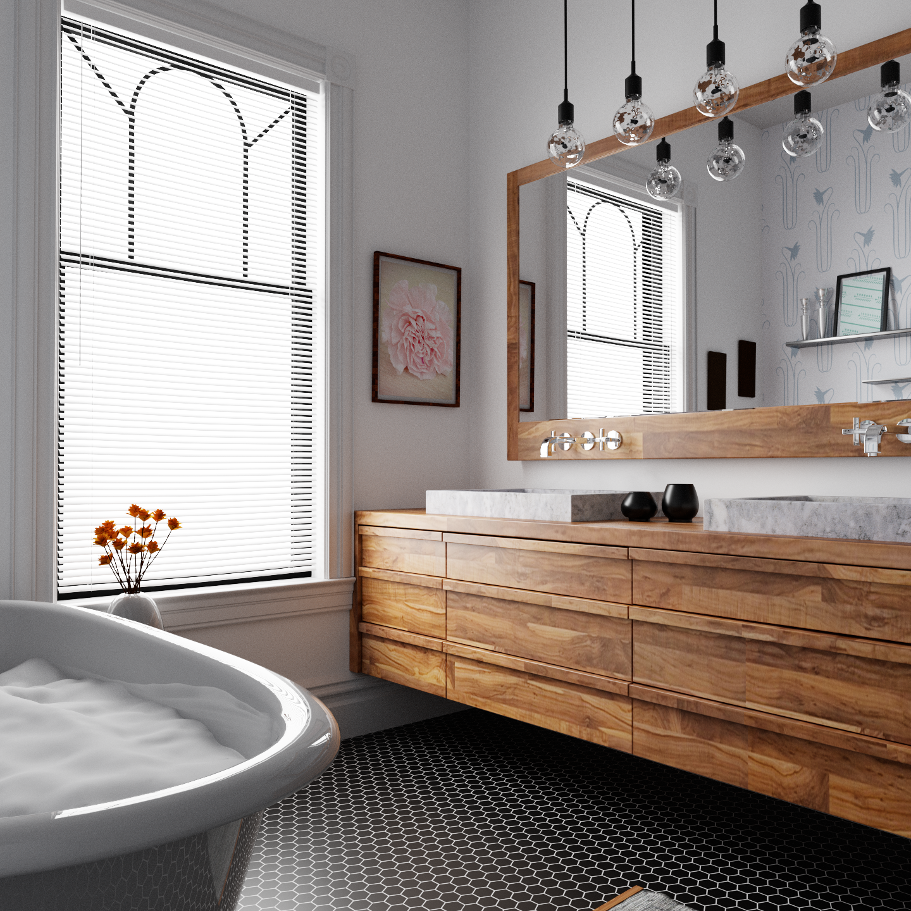
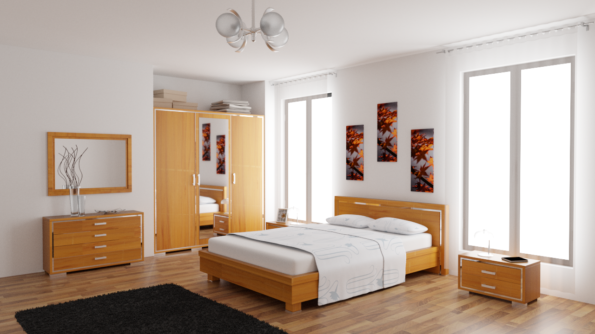
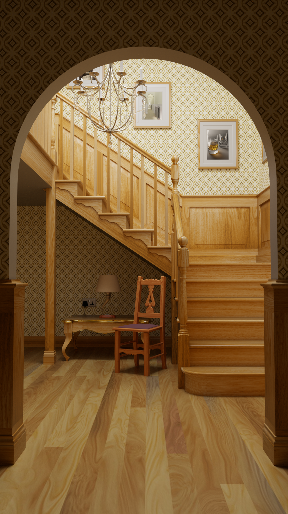

# LuisaRenderScenes
Scenes for LuisaRender.

## Bathroom (from [Rendering Resources](https://benedikt-bitterli.me/resources))

Download: [LuisaRender](https://github.com/LuisaGroup/LuisaRenderScenes/releases/download/scenes/bathroom.zip)

- Resolution: 1024x1024
- Samples: 65536
- Tonemapping: ACES (exposure = -0.5)

## Bedroom (from [Rendering Resources](https://benedikt-bitterli.me/resources))

Download: [LuisaRender](https://github.com/LuisaGroup/LuisaRenderScenes/releases/download/scenes/bedroom.zip)

- Resolution: 1280x720
- Samples: 65536
- Tonemapping: ACES (exposure = -0.5)

## Bathroom (wth Resources from [Poly Heaven](https://polyhaven.com))

Download: [LuisaRender](https://github.com/LuisaGroup/LuisaRenderScenes/releases/download/scenes/camera.zip)

- Resolution: 3840x2160
- Samples: 65536
- Tonemapping: Uncharted2

## Kitchen (from [Rendering Resources](https://benedikt-bitterli.me/resources))

Download: [LuisaRender](https://github.com/LuisaGroup/LuisaRenderScenes/releases/download/scenes/kitchen.zip)

- Resolution: 1280x720
- Samples: 65536
- Tonemapping: ACES (exposure = -0.5)

## Spaceship (from [Rendering Resources](https://benedikt-bitterli.me/resources))

Download: [LuisaRender](https://github.com/LuisaGroup/LuisaRenderScenes/releases/download/scenes/spaceship.zip)

- Resolution: 1920x1080
- Samples: 16384
- Tonemapping: Uncharted2

## Staircase (from [Rendering Resources](https://benedikt-bitterli.me/resources))

Download: [LuisaRender](https://github.com/LuisaGroup/LuisaRenderScenes/releases/download/scenes/staircase.zip)

- Resolution: 1080x1920
- Samples: 16384
- Tonemapping: Uncharted2 (exposure = 0.5)

## Coffee (from [Rendering Resources](https://benedikt-bitterli.me/resources))

Download: [LuisaRender](https://github.com/LuisaGroup/LuisaRenderScenes/releases/download/scenes/coffee.zip)

- Resolution: 1200x1800
- Samples: 16384
- Tonemapping: Uncharted2 (exposure = 0.5)

## Classroom (from [Rendering Resources](https://benedikt-bitterli.me/resources))

Download: [LuisaRender](https://github.com/LuisaGroup/LuisaRenderScenes/releases/download/scenes/classroom.zip)

- Resolution: 1920x1080
- Samples: 16384
- Tonemapping: Uncharted2 (exposure = 0.5)

## Dining Room (from [Rendering Resources](https://benedikt-bitterli.me/resources))

Download: [LuisaRender](https://github.com/LuisaGroup/LuisaRenderScenes/releases/download/scenes/dining-room.zip)

- Resolution: 1920x1080
- Samples: 16384
- Tonemapping: Uncharted2 (exposure = 0.5)

## Living Room (from [Rendering Resources](https://benedikt-bitterli.me/resources))

Download: [LuisaRender](https://github.com/LuisaGroup/LuisaRenderScenes/releases/download/scenes/living-room.zip)

- Resolution: 1920x1080
- Samples: 16384
- Tonemapping: Uncharted2 (exposure = 0.5)

## Glass of Water (from [Rendering Resources](https://benedikt-bitterli.me/resources))

Download: [LuisaRender](https://github.com/LuisaGroup/LuisaRenderScenes/releases/download/scenes/glass-of-water.zip)

- Resolution: 1920x1080
- Samples: 16384
- Tonemapping: Uncharted2

